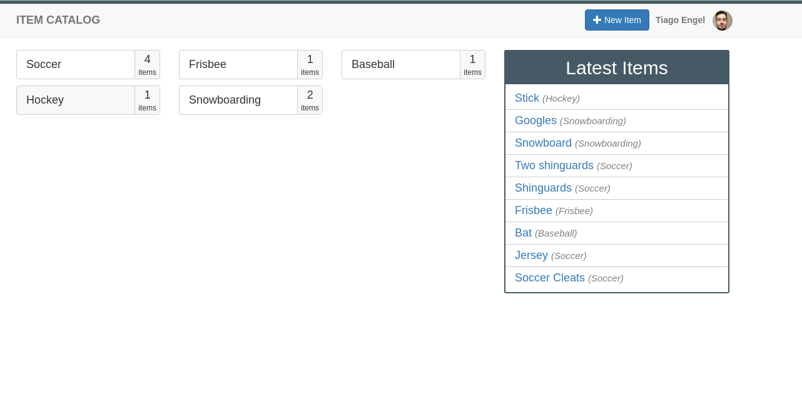

Udacity Item Catalog
==

> Web app that provides a list of items within a variety of categories.



## Prerequisites
To execute this project you will need these:
- [git](https://git-scm.com/downloads)
- [vagrant](https://www.vagrantup.com/)

## Usage

### Clone the project:

```shell
git clone https://github.com/tiagoengel/udacity-item-catalog
cd udacity-item-catalog
```

### Create and login into the vm

```shell
vagrant up
vagrant ssh
```

### Run the server

```shell
python3 /vagrant/server.py
```

### Run tests

```shell
cd /vagrant
./test.sh
```

### Load seeds

Seeds are loaded during the vm creation, you don't need to run it manually.
If you need/want to load it again.

```shell
python3 /vagrant/seed.py
```


